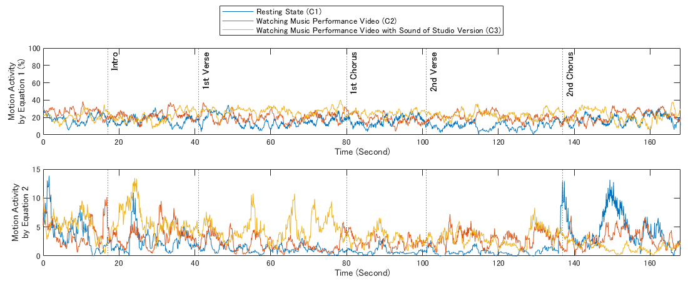

# Analysis Programs of Kinect-Based Motion Data for MATLAB (Windows 11 & NVIDIA, with KinZ-Matlab)
These programs were developed for analyzing kinect-based motion data recorded by Azure Kinect and MATLAB with [KinZ-Matlab](https://github.com/jrterven/KinZ-Matlab) (by J.Treven) in my work.  
In These Programs, there are 2 types of analyzing motion data: A. **Time series graph of motion activity** and B. **count of most shifting joint in each frame (using motion activity)**.

## Preparation for Analizing Kinect-Based Motion Data

### Installation of SDK
To use Azure Kinect, Several SDKs are needed to be installed.  

**1. CUDA (For NVIDIA)** ([*Download CUDA*](https://developer.nvidia.com/cuda-downloads?/))  
  - CUDA is needed if you have yet to install.

**2. Azure Kinect SDK** ([*Download Azure Kinect SDK*](https://github.com/microsoft/Azure-Kinect-Sensor-SDK/blob/develop/docs/usage.md))  
  - Please check your computer's compatibility with the version of SDK (In this case, the version is 1.4.1.).  

**3. Azure Kinect Body Tracking SDK** ([*Download Azure Kinect Body Tracking SDK*](https://learn.microsoft.com/en-us/azure/kinect-dk/body-sdk-download))  
  - Please check your computer's compatibility with the version of SDK (In this case, the version is 1.1.2.).  

**4. Setting up Path Environmental Variables**  
  - Directries of **k4a.dll** (normally, included in *C:\Program Files\Azure Kinect SDK v*(your version number)*\tools*) and **k4abt.dll** (normally, included in *C:\Program Files\Azure Kinect Body Tracking SDK\tools*) are needed to be added to path environmental variables.  
  - Restart your computer.  

### Installation and Modification of KinZ-Matlab
**1. MATLAB** ([*Download MATLAB*](https://www.mathworks.com/downloads/))  
  - To install MATLAB, it is necessary to create your MathWorks account.

**2. KinZ-Matlab** ([*Download KinZ-Matlab*](https://github.com/jrterven/KinZ-Matlab))  
  - Set up compiler for C++ by MATLAB.  
```
mex -setup cpp
```
OR  
```
mex -setup CPP
```
OR  
```
mex -setup c++
```
  - Run **compile_for_windows.m** and check whether bodyTrackingDemo.m can run.  
  - You might need to install Image Processing Toolbox plugin if bodyTrackingDemo.m does not work.  
  - If you want to get details, please refer to [*here*](https://github.com/jrterven/KinZ-Matlab).  

**3. Copying & Modifying bodyTrackingDemo.m**  
  - If bodyTrackingDemo.m works, copy bodyTrackingDemo.m and rename (in this case, MotionRecording.m).
  - Modify the renamed bodyTrackingDemo.m like:
```
% Loop until pressing 'q' on any figure
k=[];

disp('Press q on color figure to exit')
```
↓  
```
% Loop until pressing 'q' on any figure
k=[];

%###Write the name and dirctry###
name = '(Write name)';
Dir = '(Write directry)';
mkdir(Dir, name);
frame = 0;
%######

disp('Press q on color figure to exit')
```
And  
```
    if validData
        % Copy data to Matlab matrices        
        [depth, depthTimestamp] = kz.getdepth;
        [color, colorTimestamp] = kz.getcolor;
        numBodies = kz.getnumbodies;
        disp(numBodies)
        bodies = kz.getbodies();

        % update depth figure
        d.im = imshow(depth, 'Parent', d.ax);
```
↓  
```
    if validData
        % Copy data to Matlab matrices        
        [depth, depthTimestamp] = kz.getdepth;
        [color, colorTimestamp] = kz.getcolor;
        numBodies = kz.getnumbodies;
        disp(numBodies)
        bodies = kz.getbodies();
        
        %######
        strframe = int2str(frame);
        filename1 = append(Dir, name,'\', strframe, '.mat');
        save(filename1, 'bodies');
        dt = datetime('now');
        DateString1 = datestr(dt,'yyyyMMddHHmmssFFF');
        DateString2 = string(dt);
        filename2 = append(Dir, name,'\', strframe, '.txt');
        writelines(DateString1, filename2);
        writelines(DateString2, filename2,WriteMode="append");
        %######

        % update depth figure
        d.im = imshow(depth, 'Parent', d.ax);
```
   - If the renamed bodyTrackingDemo.m works, new folder is created and motion data of each joint's coordinate are exported in the file.

## Analysis of Kinect-Based Motion Data (Work in Progress)
After recording the motion data, you can analyze motion data by these programs for MATLAB.  
At first, you have to export the data of motion activity's set by MATLAB, then you can get A. time series graph of motion activity or B. counts of most shifting joint in each frame.  

### Exporting Motion Data as txt File
$` 
\vec{m(k)} = 100 \cdot 
\left(
\begin{array}{c}
|\vec{v_{1}(k)}| \\
|\vec{v_{2}(k)}| \\
\vdots \\
|\vec{v_{j}(k)}| \\
\end{array} \right) / |\vec{v_{max}(k)}| \;\;\; (j = 1, 2, 3, \ldots, 32)$
`$ ... (1)  

$` 
\vec{m(k)} =
\left(
\begin{array}{c}
|\vec{v_{1}(k)}| \\
|\vec{v_{2}(k)}| \\
\vdots \\
|\vec{v_{j}(k)}| \\
\end{array} \right) \;\;\; (j = 1, 2, 3, \ldots, 32)$
`$ ... (2)  

To analyze the motion data, I referred to the equation of the video viewer’s motion activity in [*Hanjalic’s study*](https://doi.org/10.1109/ICME.2003.1221610).  
The equation is used for analysis of viewer’s block-based motion in video, and I redefined the equation for kinect-based motion as shown in Eqs. (1) and (2).  
- $`m(k)`$ : Set of each joint's motion activity (coordinate parallel moving distance) between kth to k+1th frames  
- $`|\vec{v_{j}(k)}|`$ :Each joint’s motion activity between kth to k+1th frames  
- $`j`$ : Index of joints (There are 32 joints. Please refer to [*here*](https://learn.microsoft.com/en-us/azure/kinect-dk/body-joints))  

In Eq. (1), the motion activity is expressed in ratio of the average of the parallel shifting motion’s distance $`|\vec{v_{j}(k)}|`$ to the distance of the most parallel shifting motion $`|\vec{v_{max}(k)}|`$ .  
On the other hand, we provide Eq. (2), which does not include $`|\vec{v_{max}(k)}|`$ as the distance of the most parallel shifting motion.

**Used Program**  
- **MotionActivityExporter.m**: Importing recorded motion data in the file, calculating motion activity and exporting motion activity in txt file. 2 txt file which include set of motion activity calculated by each equation. 

### A. Time Series Graph of Motion Activity

As shown in the time series graph above, you can make the graph by 2 MATLAB's programs (MotionActivityTimeAxisIntegrator.m and MotionActivityPlot.m).  
Before drawing the graph, the data of motion activity exported by MotionActivityExporter.m have inconstant interflame time, so the data have to be changed inconstant interflame time to 0.1 second interflame time.  
After that, you can draw the time series graph of motion activity's mean by MATLAB.  

**Used Program**  
- **MotionActivityTimeAxisIntegrator.m**: Changing inconstant interflame time of the data of motion activity to 0.1 second interflame time of one 
- **MotionActivityPlot.m**: Drawing the time series graph of motion activity.  

### B. Count of Most Shifting Joint in Each Frame
**Used Program**  
- **MotionActivityCounter.m**  
- **MotionActivityCountMean.m**  

